 

> Most ML models are optimized to be right. Mine are optimized to be right for everyone — even the patient the training data forgot.

 

### The problem I keep circling back to

Healthcare ML that's accurate on average and wrong on the margins isn't actually working — it's just failing quietly. I spend most of my time trying to close that gap without pretending accuracy doesn't matter either. That instinct is what's behind most of what's below.

I graduated Computer Engineering at **Haliç University, Istanbul** in July 2026 as valedictorian (3.65/4.00 CGPA), and I'm looking for **ML Engineer / AI Engineer / Systems Engineer** roles where that tradeoff is taken seriously. (Also trilingual — Arabic, English, Hebrew — in case that's ever the tiebreaker.)

---

### Where this comes from

At **HASOUB**, I built MindGage end-to-end and migrated it to Google Cloud Firestore to handle continuous daily check-in data, then wired a Gemini 2.5 Flash pipeline through n8n to turn that data into real Cognitive Readiness scores for actual users — not a demo, a system people relied on daily. A year earlier, I was iterating a CBT assistant's prompts through six versions, each one benchmarked against real conversations until it measurably helped students better.

---

### What I've built

**[Algorithmic Fairness & Bias Mitigation](https://github.com/BARAAABID/algorithmic-fairness-neurodegenerative-disease)**
A clinical model can hit 93.5% accuracy and still fail specific patients quietly. I trained a CatBoost classifier to 94.9% recall and 0.963 AUC on Parkinson's detection, then applied Calibrated Equalized Odds to cut demographic bias (Equal Opportunity Difference) from 0.12 to 0.03 — while holding accuracy at 87%. Re-validated on a second disease and 10 classifiers to make sure it wasn't a fluke.
`Python` `CatBoost` `SHAP` `AIF360`

**[MindGage Infrastructure](https://github.com/BARAAABID/MindGage-Infrastructure)**
Physiological check-in data is noisy and hard to interpret in real time. This is a containerized, async FastAPI backend that turns it into structured cognitive-load insights via the Gemini API, with Pydantic validation rejecting malformed requests and a Pytest suite simulating payload attacks before anything touches production.
`FastAPI` `Docker` `SQLAlchemy` `Gemini API`

**[EEG Ingestion API](https://github.com/BARAAABID/eeg-ingestion-api)**
512Hz biosensor streams don't wait for slow code. Load-tested against 512 simulated concurrent sensor streams, this async pipeline held 109 requests/sec at a 100% success rate — zero dropped connections, zero database locks — using asyncio.Semaphore throttling and SQLite WAL to keep concurrent I/O from falling over.
`FastAPI` `aiosqlite` `AsyncIO`

---

### Currently

Deep in systems-design and algorithm fundamentals, prepping for this interview cycle — and still looking for the next fairness problem worth solving.

---

If any of this overlaps with what your team's building, my inbox is open: **baraa.abid.official@gmail.com** · [LinkedIn](https://www.linkedin.com/in/baraa-abid-91b061425/) · [GitHub](https://github.com/BARAAABID)

 

<!--
-->

